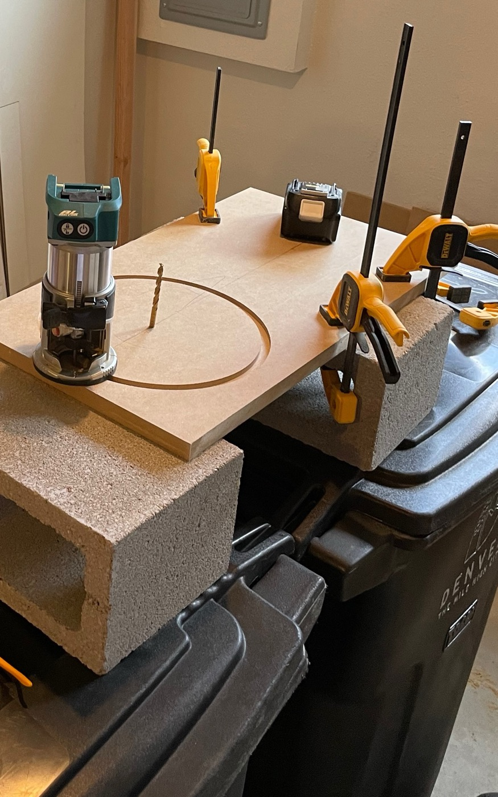
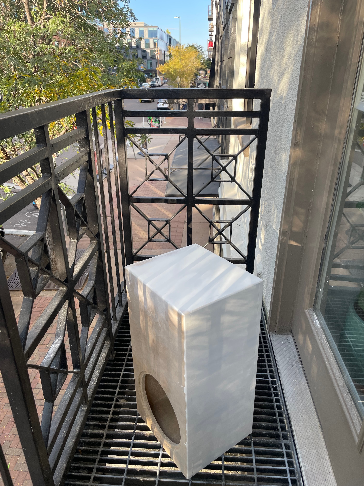
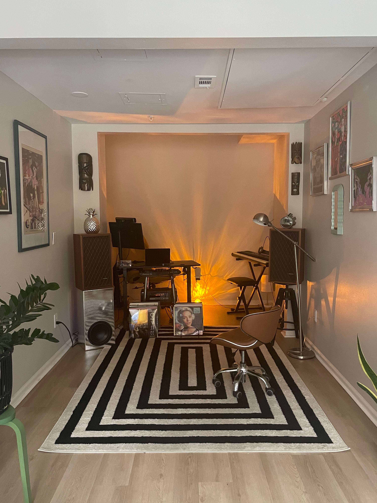
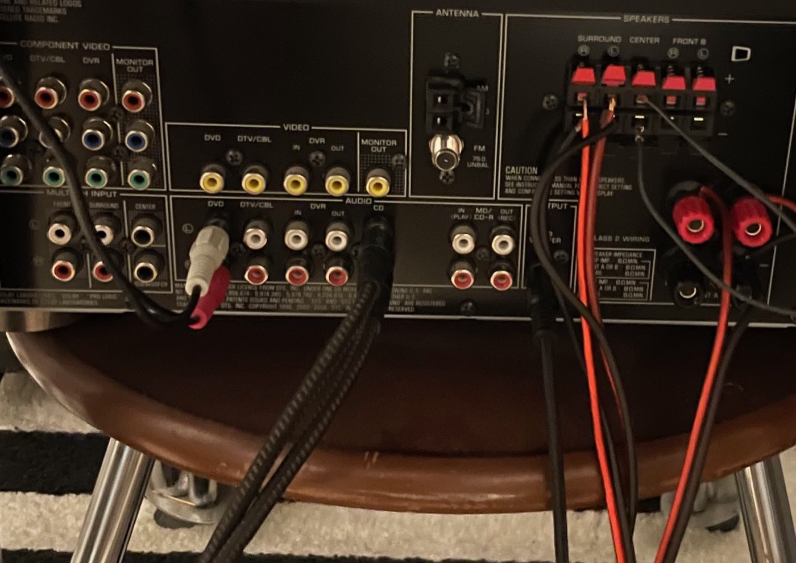
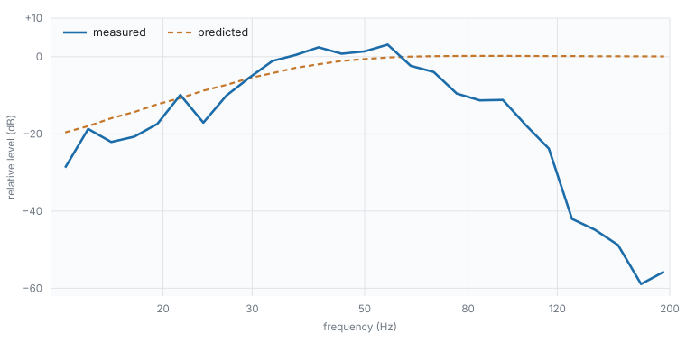

# A chrome-wrapped sealed subwoofer for a home studio

**Ezkeisac — 2026**

---

## Abstract

A sealed 10-inch subwoofer for a small home studio, presented as a constrained design
problem: a requirement that the cabinet serve as a stand for an existing monitor fixes
its cross-section, leaving height as the only dimension by which the target internal
volume can be reached.

The cabinet was built from two sheets of 19 mm MDF with hand-held power tools, glued and
clamped for 72 hours, then primed in three sanded coats and finished in chrome vinyl.
Performance predicted from the manufacturer's published Thiele–Small parameters was
compared against acoustic measurement with a Tascam DR-05 portable recorder, using a
stepped-sine method requiring no synchronisation between playback and capture.

Agreement over 20–80 Hz is 3.65 dB mean absolute error. Three results: the crossover
arises from two cascaded filters rather than one and falls within 2 Hz of its design
target; bracing is shown unnecessary by two independent arguments; and an artefact first
read as panel radiation is shown to be contamination from the main loudspeakers. The
third is retained because the error was instructive.

---

## Nomenclature

| Term | Definition |
|---|---|
| Driver | The electro-acoustic transducer; the moving cone assembly |
| Enclosure | The sealed cabinet housing the driver. The enclosed air is an acoustic element of the system, not packaging |
| Sealed alignment | An airtight enclosure. The alternative, a vented alignment, extends response lower but terminates more abruptly below tuning |
| *V*<sub>b</sub> | Enclosure internal air volume, litres |
| Thiele–Small parameters | The small-signal parameters describing driver behaviour: *F*<sub>s</sub> free-air resonance, *Q*<sub>ts</sub> total damping, *V*<sub>as</sub> equivalent compliance volume |
| *F*<sub>c</sub> | System resonance with the driver mounted in the enclosure. Always above *F*<sub>s</sub>, the enclosed air adding stiffness |
| *Q*<sub>tc</sub> | Total system damping. 0.707 gives maximally flat response |
| *F*<sub>3</sub> | Frequency at which response has fallen 3 dB below the passband |
| Crossover | The frequency at which the subwoofer yields to the main loudspeakers |
| dB | A ratio, not an absolute level. −3 dB denotes half power |
| Nearfield measurement | Measurement with the microphone within centimetres of the radiating surface, minimising room contribution |

---

## 1. Design requirements

Requirements were stated such that each could be evaluated against measurement on
completion. Verification is reported in [`DISCUSSION.md`](DISCUSSION.md) §6.1.

| # | Requirement |
|---|---|
| **R1** | Useful output to approximately 35 Hz |
| **R2** | Seamless integration with a pair of Realistic Nova 7B main loudspeakers |
| **R3** | Cross-sectional area equal to that of a Nova 7B, permitting the subwoofer to serve as its base |
| **R4** | Mirror-finish chrome exterior |
| **R6** | Crossover to the mains at 60 Hz |

R3 and R6 determined the rest. R3 converts the enclosure from a free design into a
constrained one (§2). R6 was not a preference: the low-frequency limit of the Nova 7B pair
was measured, and 60 Hz is where the subwoofer must assume responsibility.

> **Outstanding.** The measured low-frequency limit of the Nova 7B and its cabinet
> footprint are not recorded here. Both are inputs to R3 and R6 and should be stated in
> a revision.

---

## 2. Enclosure design

All dimensional and volumetric figures, and the derivation that produces them, are in
[`calculations/`](calculations/) — [`derive_box.py`](calculations/derive_box.py),
[`box-dimensions.csv`](calculations/box-dimensions.csv),
[`volume.csv`](calculations/volume.csv),
[`driver-parameters.csv`](calculations/driver-parameters.csv).

```bash
python3 calculations/derive_box.py
```

### 2.1 An inverted design problem

Enclosure design normally begins with a target volume and arrives at proportions, which
are chosen for whatever suits — a cube for stiffness, a slim tower for floor area, a
squat box to sit under a desk. The acoustic requirement leads and the shape follows.

R3 inverts that. Requiring the cabinet to carry a monitor fixes its footprint before any
acoustic consideration is admitted, and a fixed footprint fixes the internal
cross-sectional area once wall thickness is subtracted. **The shape leads and the volume
must follow.**

This leaves the design with a single degree of freedom. Where a conventional enclosure is
specified by three dimensions chosen together, this one has two imposed and one to solve:
height is whatever satisfies the volume requirement across the area already given. The
derivation is therefore a division, and the interesting work lies in what that division
constrains rather than in performing it.

### 2.2 Accounting for the driver

The volume the driver experiences is not the volume enclosed. Magnet and basket occupy
space and must be deducted, and doing so properly requires measuring them rather than
estimating: both were determined by water displacement. The distinction matters because
every subsequent prediction is a function of the effective volume, not the internal one.

### 2.3 Consequence of the constraint

Solving under R3 produces a column roughly twice as tall as it is wide, where an
unconstrained enclosure of the same volume would approximate a cube. The proportions are
therefore a consequence of a requirement rather than a preference — and they are not
acoustically neutral, since a tall narrow box has one panel substantially larger than the
others. Whether that matters is the question §6.2 answers.

### 2.4 Driver parameters and their standing

Prediction proceeds from the **manufacturer's published Thiele–Small parameters** for the
GRS 10SW-4HE, taken from the driver manual. They were not independently measured.

This is a methodological weakness stated rather than concealed. Unit-to-unit tolerance on
these parameters is routinely ±10–20%, so they describe a driver of this model rather
than necessarily this specimen, and every quantity derived from them inherits that
uncertainty. §6.3 returns to it: one unresolved residual would be accounted for if the
published figures do not describe the driver actually fitted.

Substituting them into the standard sealed-alignment relations gives a system damping
slightly above Butterworth. That was accepted deliberately rather than corrected — a
small room contributes low-frequency gain of its own, and a gently rolling response
combines with that gain more predictably than a flat anechoic one does.

---

## 3. Construction

### 3.1 Fabrication

Hand-held power tools throughout; no table saw or router table. Panels were cut from two
sheets of 19 mm MDF.

The driver aperture was set out with a pivot and rule, then cut with a compact router on
a circle-cutting jig (Figure 1). The aperture is **rebated**: a shallow circular shoulder
is machined concentric with the through-hole so the 257 mm driver flange seats flush with
the baffle. A routed aperture gives a consistent radius and a clean rebate shoulder,
neither reliably achievable with a jigsaw.


**Figure 1.** Driver aperture marked and about to be routed, the pivot at centre. Work is
clamped to masonry blocks over a wheeled bin — the whole build used hand-held tools on an
improvised bench. Respiratory and eye protection were worn throughout; MDF dust is a
recognised hazard.

Joints were **glued and clamped for 72 hours**. Extended clamping is material rather than
precautionary: a sealed alignment is only valid if the enclosure is airtight, and at this
panel size a joint left to cure under its own weight will creep.

**No internal bracing was fitted.** §6.2 establishes that none was required.

### 3.2 Surface preparation

Preparation, not wrapping, is the operation that produces a mirror finish. The sequence
was:

1. **Hand-sanding over every surface.**
2. **Three coats of primer, sanded between coats.** This is the white coating visible in
   Figure 2.
3. Final sanding, then vinyl.

Priming is not cosmetic here and cannot be skipped. MDF is porous and its routed edges
more so; an unsealed surface absorbs unevenly and telegraphs its own fibre through any
film laid over it. Successive primer coats fill that structure, and sanding between coats
removes what each coat raises, converging on a flat, sealed, non-absorbent substrate.


**Figure 2.** Cabinet after priming, before vinyl. The white coating is the third primer coat;
the baffle is still bare MDF, showing the rebated aperture and the exposed core at the cut
edge.

Why this matters is visible in Figure 3. Examining the reflection rather than the object,
horizontal banding runs across the largest face — not a defect in the vinyl, but residual
substrate geometry magnified by the finish. A matte coating conceals of the order of one
millimetre of departure from flatness across 600 mm; a specular finish renders the same
departure as a line visible at conversational distance. **A chrome wrap functions as a
measuring instrument for the flatwork beneath it**, which makes preparation the principal
operation and the wrap the short step at the end.

### 3.3 Vinyl application

VViViD DECO65 chrome vinyl, one roll of 20 ft × 11.8 in. **Pieces were cut from the roll
and fitted at the joints of the cabinet.**

The placement is deliberate. On a specular finish a seam is permanent and conspicuous,
the reflection rendering the join visible from any angle. Sited on a corner, where the
surface is already turning away from the observer, a seam is read as an edge; displaced
40 mm onto a flat face, the same seam is read as a defect.

> DECO65 is a calendered craft vinyl rather than a cast automotive film. It accommodates
> flat panels and eased edges but is not suited to compound curvature.


**Figure 3.** Completed cabinet in position, a Nova 7B standing on it per R3.

---

## 4. Measurement method

Implementation, entirely in the Python standard library with nothing to install:
[`scripts/`](scripts/). Each script carries a `selftest`.

### 4.1 Signal path

The subwoofer is one element of a 5.1 system, and what the receiver does to the signal
before it reaches the plate amplifier turns out to matter more than anything downstream
of it.


**Figure 4.** The system as wired. Nova 7B mains on the FRONT A binding posts at right; two
surround speakers and a small booth monitor on the SURROUND and CENTER clip terminals; the
subwoofer on the SUB WOOFER RCA output. Source equipment occupies the AUDIO inputs — a
turntable on DVD, a DJ controller on CD. Serial number cropped.

The consequential detail is that the subwoofer is driven from SUB WOOFER rather than a
full-range output. **That places two low-pass filters in series**, the receiver's own and
the plate amplifier's, and their slopes sum. A measurement of the system therefore
characterises the pair, and attributing the result to the amplifier alone would be an
error — one §6.1 has to unpick.

Only the main pair and the subwoofer participate in the measurements reported here. The
remaining channels carry nothing during a stereo sweep and were left connected.

Receiver signal processing was disabled and the volume control marked, so the path is
linear and identical between takes. A gain change between takes would introduce a fixed
error into every subsequent comparison with nothing in the data to reveal it.

### 4.2 Why stepped tones rather than a sweep

Playback and capture ran on separate devices sharing no clock — a laptop and the DR-05.
Swept measurement assumes the two can be aligned in time, and they cannot be.

A stepped excitation removes the assumption instead of working around it. Each tone is an
independent measurement at a frequency known exactly, so drift between the devices has
nothing to corrupt: there is no timeline to preserve, only a set of separate observations.
The frequency being known also means magnitude can be extracted directly at that
frequency rather than by transforming the whole recording, which is why the analysis
needs no numerical libraries.

Two details follow from the same reasoning. Window length is scaled to frequency rather
than held constant, because a window fixed in seconds contains progressively fewer cycles
as frequency falls, and the region of interest is the lowest. And the generator records
where every tone was placed, which the analyser reads rather than recomputing — two
programs deriving the same layout independently is an opportunity for them to disagree
silently.

### 4.3 What the method can establish

The instrument is an uncalibrated recorder, so the measurements are **relative**. Spectral
shape is available — the position of a knee, the slope below it, where one source yields
to another — and absolute sound pressure is not.

This is a real limitation and it bounds what §6.1 may claim. It is also a tolerable one,
because every prediction made here is a statement about shape.

### 4.4 Error sources identified during measurement

Three procedural errors are recorded because each produced a plausible result rather than
an obviously broken one, and a plausible wrong answer is the more dangerous failure:

1. **An alignment marker outside the system's passband is not reproduced.** A 1 kHz
   marker cannot survive a chain that low-passes, so automatic detection locks to the
   first loud event instead and displaces every window.
2. **Clipping synthesises a flat response.** A saturated take measured flat across an
   octave and agreed with prediction *better* than the valid one. Saturation must be
   excluded before a result is interpreted, not after it looks wrong.
3. **A microphone near the subwoofer is not measuring the subwoofer.** With a main
   loudspeaker standing on the cabinet, no proximate position is acoustically isolated.
   See §6.2.

---

## 5. Results


**Figure 5.** Measured response of the isolated subwoofer against the sealed-alignment
prediction, 12–200 Hz. Relative level, normalised to a reference band; the uncalibrated
instrument gives no absolute reference. Regenerate with
`python3 scripts/plot_response.py`.

Measurement source: [`data/response_sub_isolated.csv`](data/response_sub_isolated.csv) —
mains disconnected, 24-bit, peak −2.8 dBFS, no saturation, 45 of 45 tones recovered.
Point-by-point values:
[`calculations/measured-vs-predicted.csv`](calculations/measured-vs-predicted.csv).

Over 20–80 Hz the mean absolute difference is **3.65 dB**. Two structures are present in
the residual, and they have different causes. An excess in the region of
*F*<sub>c</sub> is unexplained and treated in §6.3. The attenuation above 60 Hz is not a
property of the enclosure at all but of the signal path described in §4.1, and is
resolved in §6.1.

---

## 6. Discussion

Verification against each requirement, the bracing question, the superseded panel result,
the unresolved residual and recommendations for repetition are set out in
**[`DISCUSSION.md`](DISCUSSION.md)**.

In summary: R1 supported but not confirmed, an uncalibrated instrument giving no absolute
reference; R2, R3, R4 satisfied; R6 satisfied, the plate amplifier's own setting deriving
to within 2 Hz of the 60 Hz requirement once the receiver's fixed stage is deconvolved.
Bracing is shown unnecessary by two independent arguments. One residual of about 3 dB near
*F*<sub>c</sub> remains unexplained, with three candidate causes and none eliminated.

---

## 7. Materials

Total **$357.84**, itemised in
[`calculations/materials-cost.csv`](calculations/materials-cost.csv). Fasteners, adhesive,
primer and sealant are not costed.

---

## References

[1] Yamaha Corporation, *RX-V361 AV Receiver Owner's Manual*.
https://data.yamaha.com/files/download/other_assets/3/319863/RX-V361_manual.pdf

---

## Repository

| | Contents |
|---|---|
| [`DISCUSSION.md`](DISCUSSION.md) | Verification against requirements, the bracing question, the superseded panel result, and recommendations |
| [`calculations/`](calculations/) | Dimensions, volumes, driver parameters, the measured-against-predicted table, cost schedule, and executable derivations |
| [`scripts/`](scripts/) | Excitation, analysis and plotting. Standard library only; each carries a `selftest` |
| [`data/`](data/) | Raw measurement data with provenance and stated limitations |
| [`images/`](images/) | Construction, system and completed-assembly photographs |

Licence: documentation CC BY-SA 4.0, code MIT — [`LICENSE`](LICENSE).
