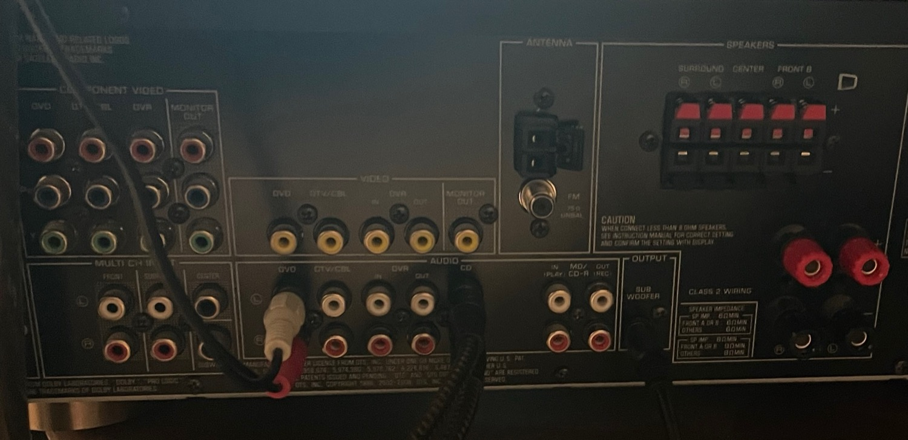

# A chrome-wrapped sealed subwoofer for a home studio: design under a fixed-footprint constraint, and its acoustic verification

**Isaac — 2026**

Documentation CC BY-SA 4.0 · code MIT · [`LICENSE`](LICENSE)

---

## Abstract

A sealed 10-inch subwoofer for a small home studio, presented as a constrained design
problem: a requirement that the cabinet serve as a stand for an existing monitor fixes
its cross-section, leaving height as the only dimension by which the target internal
volume can be reached.

The cabinet was built from two sheets of 19 mm MDF with hand-held power tools, glued and
clamped for 72 hours, then primed in three sanded coats and finished in chrome vinyl. Performance predicted from the manufacturer's published Thiele–Small
parameters was compared against acoustic measurement with a Tascam DR-05 portable
recorder, using a stepped-sine method requiring no synchronisation between playback and
capture.

Agreement over 20–80 Hz is 3.65 dB mean absolute error. Three results: the crossover
arises from two cascaded filters rather than one and falls within 2 Hz of its design
target; bracing is shown unnecessary by two independent arguments; and an artefact first
read as panel radiation is shown to be contamination from the main loudspeakers. The
third is retained because the error was instructive.

---

## Nomenclature

| Term | Definition |
|---|---|
| Driver | The electro-acoustic transducer; the moving cone assembly |
| Enclosure | The sealed cabinet housing the driver. The enclosed air is an acoustic element of the system, not packaging |
| Sealed alignment | An airtight enclosure. The alternative, a vented alignment, extends response lower but terminates more abruptly below tuning |
| *V*<sub>b</sub> | Enclosure internal air volume, litres |
| Thiele–Small parameters | The small-signal parameters describing driver behaviour: *F*<sub>s</sub> free-air resonance, *Q*<sub>ts</sub> total damping, *V*<sub>as</sub> equivalent compliance volume |
| *F*<sub>c</sub> | System resonance with the driver mounted in the enclosure. Always above *F*<sub>s</sub>, the enclosed air adding stiffness |
| *Q*<sub>tc</sub> | Total system damping. 0.707 gives maximally flat response |
| *F*<sub>3</sub> | Frequency at which response has fallen 3 dB below the passband |
| Crossover | The frequency at which the subwoofer yields to the main loudspeakers |
| dB | A ratio, not an absolute level. −3 dB denotes half power |
| Nearfield measurement | Measurement with the microphone within centimetres of the radiating surface, minimising room contribution |

---

## 1. Design requirements

Requirements were stated such that each could be evaluated against measurement on
completion. Verification is reported in §6.1.

| # | Requirement |
|---|---|
| **R1** | Useful output to approximately 35 Hz |
| **R2** | Seamless integration with a pair of Realistic Nova 7B main loudspeakers |
| **R3** | Cross-sectional area equal to that of a Nova 7B, permitting the subwoofer to serve as its base |
| **R4** | Mirror-finish chrome exterior |
| **R6** | Crossover to the mains at 60 Hz |

R3 and R6 determined the rest. R3 converts the enclosure from a free design into a
constrained one (§2). R6 was not a preference: the low-frequency limit of the Nova 7B pair
was measured, and 60 Hz is where the subwoofer must assume responsibility.

> **Outstanding.** The measured low-frequency limit of the Nova 7B and its cabinet
> footprint are not recorded here. Both are inputs to R3 and R6 and should be stated in
> a revision.

---

## 2. Enclosure design

Complete working: [`derive_box.py`](calculations/derive_box.py) ·
[`box-dimensions.csv`](calculations/box-dimensions.csv) ·
[`volume.csv`](calculations/volume.csv)

```bash
python3 calculations/derive_box.py
```

### 2.1 Method

Conventional design proceeds from a target volume to proportions chosen for convenience.
Here the proportions are given and the volume must be reached through what remains.

**R3 fixes the cross-section.** The footprint must match a Nova 7B, so external width and
length are set before any acoustic consideration enters. Internal cross-section follows
by subtracting two wall thicknesses:

| Quantity | Value |
|---|---|
| External cross-section | 318 × 280 mm (fixed by R3) |
| Wall thickness | 19 mm (¾ in MDF) |
| Internal cross-section | 280 × 242 mm |
| Internal area *A* | 67,760 mm² = 0.06776 m² |

**Height is solved from the volume.** With *A* fixed, one dimension remains:

> *h* = *V* / *A* = 42.21 L ÷ 0.06776 m² = **622.9 mm**

The cabinet was built at 623 mm.

**Driver displacement is deducted.** The magnet and basket occupy enclosure volume;
what remains is acoustically effective. Measured by water displacement:

| Quantity | Litres |
|---|---|
| Internal volume | 42.21 |
| Magnet | 0.62 |
| Basket | 2.51 |
| Driver displacement | 3.13 |
| **Effective volume** *V*<sub>b</sub> | **39.08** |

### 2.2 Consequence of the constraint

An unconstrained 42 L enclosure approximates a 348 mm cube. R3 precludes it: holding the
footprint and solving for height yields a column **2.2 times taller than wide**. The
proportions are a consequence of the requirement, and they produce one panel
substantially larger than the others — which raises the bracing question addressed in
§6.2.

### 2.3 Driver parameters

Prediction uses the **manufacturer's published Thiele–Small parameters** for the
GRS 10SW-4HE, taken from the driver manual. These were not independently measured, and
unit-to-unit tolerance is routinely ±10–20% — so they describe a driver of this model
rather than necessarily this specimen. §6.3 returns to this, as one unresolved residual
would be accounted for by their being inaccurate.

| Parameter | Value |
|---|---|
| *F*<sub>s</sub> | 25.2 Hz |
| *Q*<sub>ts</sub> | 0.50 |
| *V*<sub>as</sub> | 60.7 L |
| *R*<sub>e</sub> | 3.8 Ω |
| *S*<sub>d</sub> | 346.4 cm² |
| *X*<sub>max</sub> | 11 mm |

Substituting into the sealed-alignment relations gives *Q*<sub>tc</sub> = 0.799,
*F*<sub>c</sub> = 40.27 Hz, *F*<sub>3</sub> = 36.16 Hz. Sitting slightly above Butterworth
(0.707) was accepted deliberately: a small room contributes low-frequency gain, and a
gently rolling response combines with that gain more predictably than a flat anechoic
one.

---

## 3. Construction

### 3.1 Fabrication

Hand-held power tools throughout; no table saw or router table. Panels were cut from two
sheets of 19 mm MDF.

The driver aperture was set out with a pivot and rule, then cut with a compact router on
a circle-cutting jig (Figure 1). The aperture is **rebated**: a shallow circular shoulder
is machined concentric with the through-hole so the 257 mm driver flange seats flush with
the baffle. A routed aperture gives a consistent radius and a clean rebate shoulder,
neither reliably achievable with a jigsaw.


**Figure 1.** Driver aperture marked and about to be routed, the pivot at centre. Work is
clamped to masonry blocks over a wheeled bin — the whole build used hand-held tools on an
improvised bench. Respiratory and eye protection were worn throughout; MDF dust is a
recognised hazard.

Joints were **glued and clamped for 72 hours**. Extended clamping is material rather than
precautionary: a sealed alignment is only valid if the enclosure is airtight, and at this
panel size a joint left to cure under its own weight will creep.

**No internal bracing was fitted.** §6.2 establishes that none was required.

### 3.2 Surface preparation

Preparation, not wrapping, is the operation that produces a mirror finish. The sequence
was:

1. **Hand-sanding over every surface.**
2. **Three coats of primer, sanded between coats.** This is the white coating visible in
   Figure 2.
3. Final sanding, then vinyl.

Priming is not cosmetic here and cannot be skipped. MDF is porous and its routed edges
more so; an unsealed surface absorbs unevenly and telegraphs its own fibre through any
film laid over it. Successive primer coats fill that structure, and sanding between coats
removes what each coat raises, converging on a flat, sealed, non-absorbent substrate.


**Figure 2.** Cabinet after priming, before vinyl. The white coating is the third primer coat;
the baffle is still bare MDF, showing the rebated aperture and the exposed core at the cut
edge.

Why this matters is visible in Figure 3. Examining the reflection rather than the object,
horizontal banding runs across the largest face — not a defect in the vinyl, but residual
substrate geometry magnified by the finish. A matte coating conceals of the order of one
millimetre of departure from flatness across 600 mm; a specular finish renders the same
departure as a line visible at conversational distance. **A chrome wrap functions as a
measuring instrument for the flatwork beneath it**, which makes preparation the principal
operation and the wrap the short step at the end.

### 3.3 Vinyl application

VViViD DECO65 chrome vinyl, one roll of 20 ft × 11.8 in. **Pieces were cut from the roll
and fitted at the joints of the cabinet.**

The placement is deliberate. On a specular finish a seam is permanent and conspicuous,
the reflection rendering the join visible from any angle. Sited on a corner, where the
surface is already turning away from the observer, a seam is read as an edge; displaced
40 mm onto a flat face, the same seam is read as a defect.

> DECO65 is a calendered craft vinyl rather than a cast automotive film. It accommodates
> flat panels and eased edges but is not suited to compound curvature.


**Figure 3.** Completed cabinet in position, a Nova 7B standing on it per R3.

---

## 4. Measurement method

Analysis software, implemented in the Python standard library with no external
dependencies: **[`scripts/`](scripts/)**

### 4.1 Signal path

The studio runs a 5.1 layout on a Yamaha RX-V361 (Figure 4).


**Figure 4.** Receiver rear panel as connected. Terminal groups, left to right: MULTI CH INPUT
and AUDIO inputs; ANTENNA; SPEAKERS clip terminals for SURROUND R/L, CENTER and FRONT B;
OUTPUT / SUB WOOFER; and FRONT A binding posts at right. Serial number cropped.

| Output | Connection |
|---|---|
| **FRONT A** binding posts | Nova 7B × 2 — the main pair |
| **CENTER**, **SURROUND R/L** clip terminals | three additional speakers |
| **SUB WOOFER** RCA | SPA300-D line input → 10-inch driver |

Only the FRONT A pair and the subwoofer are relevant to the measurements reported here.
The centre and surround channels carry no content during a stereo sweep and were left
connected but idle.

The subwoofer is driven from SUB WOOFER rather than a full-range line output, and **two
low-pass filters therefore act in series, their slopes summing.** The receiver applies a
fixed stage on this output, stated in the manual [1] as passing content below 90 Hz and
not user-adjustable; the plate amplifier applies a second, adjustable stage. §6.1
quantifies the combined result.

Throughout measurement the receiver's signal processing was disabled and its volume
control marked, ensuring a linear and repeatable path between takes.

### 4.2 Excitation and analysis

Playback and capture ran on separate devices sharing no clock — a laptop and the DR-05. A
swept measurement requires the two to be aligned in time; **a stepped-sine excitation does
not**, each tone being an independent measurement at a known frequency.

Forty-five tones, logarithmically spaced 5–500 Hz. Window length scales inversely with
frequency — 1.60 s at the lower limit, 0.50 s above 16 Hz — since 0.5 s at 5 Hz contains
only 2.5 cycles and *F*<sub>s</sub> lies in that region. The generator emits a manifest
recording the sample position of every tone, which the analyser reads rather than
recomputing, so the two cannot disagree about which window belongs to which frequency.

Each tone's frequency being known, its magnitude comes from a single DFT bin evaluated at
that frequency — one FFT bin's cost without the transform. Temporal alignment is found by
search: at the correct offset each window contains its tone in full, while misaligned
windows straddle boundaries and lose amplitude. The maximum typically exceeds the
worst-case offset by two orders of magnitude.

### 4.3 Limitations

The method resolves **relative spectral shape** — *F*<sub>3</sub>, slope, the position of
a knee, the location of a crossover — but not absolute sound pressure level, the
microphone being uncalibrated. All curves are normalised to a reference band. Shape is
the quantity the prediction concerns, which limits the practical cost.

### 4.4 Error sources identified during measurement

Three procedural errors, each having produced a plausible rather than an evidently
erroneous result:

1. **A 1 kHz alignment marker is not reproduced by a subwoofer.** The signal chain
   low-passes the marker; automatic detection consequently locks to the first
   high-amplitude event instead, displacing every analysis window.
2. **Clipping synthesises a flat response.** A take peaking at 0 dBFS measured flat to
   within 0.5 dB across an octave and returned *better* agreement with prediction than
   the valid take. Sample-level saturation must be excluded before interpretation.
3. **The microphone captures the complete system.** With a main loudspeaker standing on
   the subwoofer, no proximate microphone position is acoustically isolated. See §6.2.

---

## 5. Results

Measurement source: `data/response_sub_isolated.csv`. Mains disconnected, 24-bit WAV,
peak −2.8 dBFS, no sample saturation, 45 of 45 tones recovered.

**Table 1.** Measured response against prediction, 20–80 Hz. Mean absolute error 3.65 dB.

| Frequency (Hz) | Measured (dB) | Predicted (dB) | Difference (dB) |
|---|---|---|---|
| 21.6 | −9.46 | −10.63 | +1.17 |
| 26.7 | −9.61 | −7.19 | −2.41 |
| 29.6 | −4.94 | −5.44 | +0.50 |
| 32.9 | −0.64 | −4.16 | +3.53 |
| 36.5 | +0.89 | −2.78 | +3.68 |
| 40.6 | +2.88 | −1.88 | +4.76 |
| 45.0 | +1.23 | −1.01 | +2.24 |
| 50.0 | +1.83 | −0.52 | +2.35 |
| 55.5 | +3.58 | −0.11 | +3.69 |
| 61.6 | −1.91 | +0.13 | −2.04 |
| 68.4 | −3.50 | +0.23 | −3.73 |
| 76.0 | −9.11 | +0.29 | −9.41 |

Two structures are present in the residual: an excess in the region of *F*<sub>c</sub>,
and an attenuation above 60 Hz not predicted by the enclosure model. The latter is
attributable to the signal path and is treated in §6.1.

---

## 6. Discussion

### 6.1 Verification against requirements

**R1 — output to approximately 35 Hz.** Predicted *F*<sub>3</sub> is 36.2 Hz, and the
measured spectral shape is consistent with this value. **Supported but not confirmed**, an
uncalibrated instrument providing no absolute reference.

**R2 — integration with the mains.** The acoustic transition occurs near 80 Hz with
neither a deficiency nor an excess evident across the overlap. **Satisfied** within the
resolution of the method.

**R3 — footprint.** Satisfied by construction (Figure 3).

**R4 — chrome finish.** Satisfied (Figure 3).

**R6 — 60 Hz crossover.** Measurement gives the combined filter chain as fourth-order,
−3 dB at **57 Hz**. Deconvolving the receiver's fixed 90 Hz SUB WOOFER stage [1] places the plate
amplifier's own setting at approximately **62 Hz**, within 2 Hz of the requirement.
**Satisfied.** Derivation: [`calculations/derive_crossover.py`](calculations/derive_crossover.py).

> This deconvolution assumes the receiver stage to be second-order at 90 Hz. The manual
> specifies the frequency but not the slope, which was not independently confirmed. **The
> combined result — fourth-order at 57 Hz — is measured directly and is independent of
> how the two stages divide.**

### 6.2 Enclosure resonance and the necessity of bracing

Two independent arguments.

**Analytically:** treating the largest panel (280 × 623 mm, 19 mm MDF) as a rectangular
plate bounds its fundamental bending mode between 260 and 590 Hz, across simply-supported
to fully-clamped edge conditions and a realistic range of MDF elastic modulus
([`panel_modes.py`](scripts/panel_modes.py)). **Empirically:** the isolated subwoofer
measures **59 dB below reference at 175 Hz**.

A panel radiates at its resonance only when excited there. Since no significant energy
above roughly 100 Hz reaches the driver, the panel resonance — wherever it falls within
the computed bounds — is never excited, and bracing would have served no function.

**A superseded result.** With the microphone at the side panel, an excess of 5–11 dB was
initially observed between 104 and 195 Hz, consistent in form with panel radiation. It did
not survive isolation of the source: a main loudspeaker stands on the subwoofer, so moving
the microphone from cone to panel also moved it relative to that loudspeaker. With the
mains disconnected the difference between conditions above 128 Hz is 24–43 dB, increasing
with frequency — the behaviour of two-way loudspeakers assuming the band.

The error was caught only because the measurement had been recorded as confounded before
the isolated take existed. **A result consistent with an anticipated conclusion warrants
greater scrutiny, not less.**

### 6.3 Unresolved residual

Between 32 and 56 Hz, clear of the filter chain, measurement exceeds prediction by about
3 dB. Three hypotheses: the published parameters do not describe this specimen (§2.3);
boundary reinforcement, the cabinet being against a wall; or non-flat microphone response.

**None is eliminated by the present data.** The residual is a maximum centred near
*F*<sub>c</sub> rather than a monotonic rise toward low frequency, the latter being more
characteristic of boundary loading — weakly favouring the first without establishing it.
Resolution requires measured driver parameters, or repetition with the cabinet away from
the boundary.

### 6.4 Recommendations for repetition

- **Measure driver parameters prior to construction.** Every unresolved residual reported
  here admits "the published parameters may be inaccurate" among its hypotheses.
- **Document construction contemporaneously.** Portions of §3 are reconstructed.
- **Employ a calibrated microphone.** This converts every relative measurement reported
  here into an absolute one, at a cost small relative to the build.
- **Account for both filter stages at the design stage.** The receiver's fixed 90 Hz
  stage was not anticipated, and the plate amplifier was adjusted as though it were the
  only filter in the path.

---

## 7. Materials

**Total: $357.84.** Itemised in
[`calculations/materials-cost.csv`](calculations/materials-cost.csv).

| Item | Qty | Unit | Ext |
|---|---|---|---|
| GRS 10SW-4HE, 10 in 4 Ω driver | 1 | $61.98 | $61.98 |
| Dayton SPA300-D, 300 W plate amplifier | 1 | $167.98 | $167.98 |
| MDF, ¾ in × 4 ft × 8 ft | 2 | $48.98 | $97.96 |
| VViViD DECO65 chrome vinyl, 20 ft × 11.8 in | 1 | $11.98 | $11.98 |
| RCA Y cable | 1 | $7.99 | $7.99 |
| Speaker wire, 16 AWG, 9.14 m | 1 | $9.95 | $9.95 |
| | | **Total** | **$357.84** |

Fasteners, adhesive, primer and sealant are not costed.

---

## References

[1] Yamaha Corporation, *RX-V361 AV Receiver Owner's Manual*.
https://data.yamaha.com/files/download/other_assets/3/319863/RX-V361_manual.pdf

---

## Repository

| Directory | Contents |
|---|---|
| [`calculations/`](calculations/) | Dimensional and volumetric data, cost schedule, and executable derivations |
| [`scripts/`](scripts/) | Excitation generation and analysis. Standard library only; each carries a `selftest` |
| [`data/`](data/) | Measurement data with provenance and stated limitations |
| [`images/`](images/) | Construction and completed-assembly photographs |
