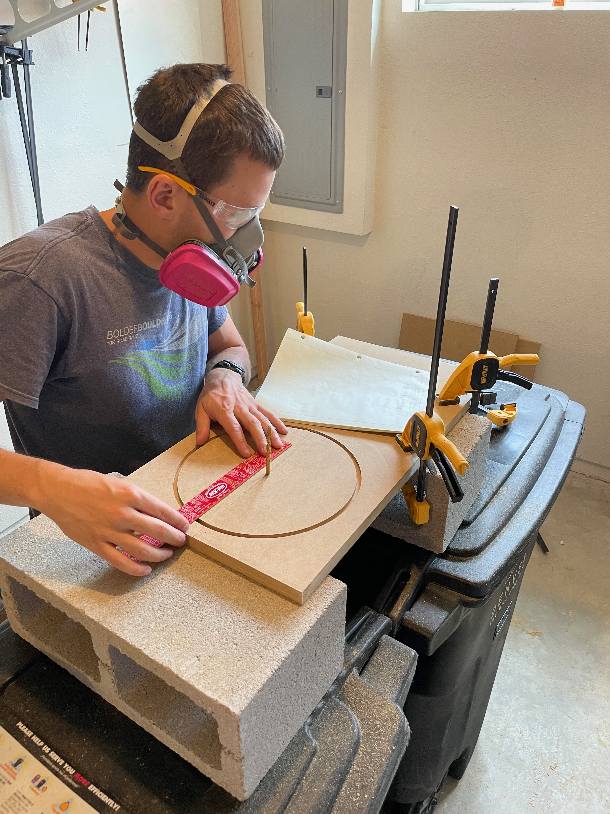
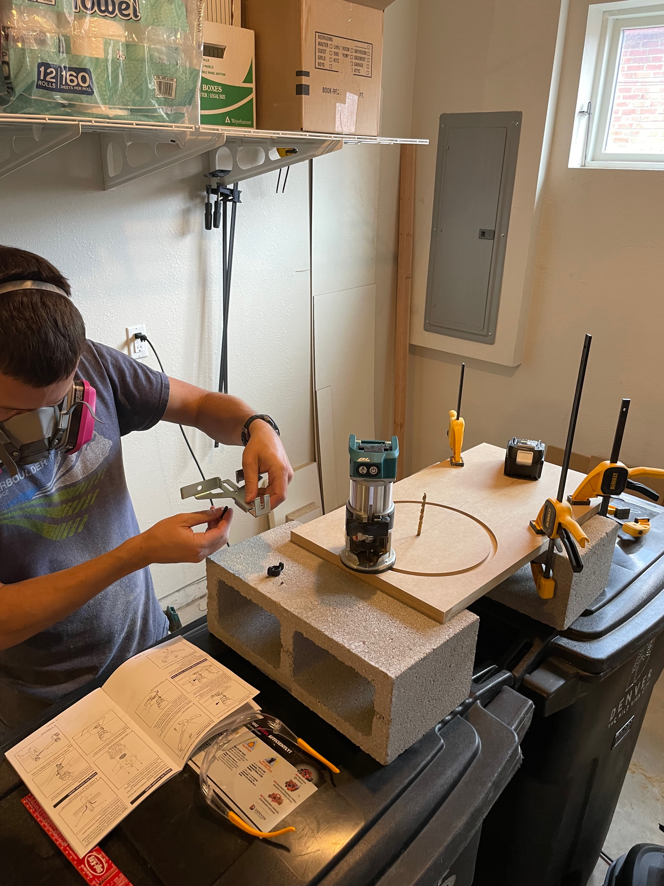

# A chrome-wrapped sealed subwoofer for a home studio: design under a fixed-footprint constraint, and its acoustic verification

**Isaac — 2026**

Documentation CC BY-SA 4.0 · code MIT · [`LICENSE`](LICENSE)

---

## Abstract

This paper documents the design, construction and acoustic verification of a sealed
10-inch subwoofer built for a small home studio.

The enclosure differs from a conventional design in that its proportions were not
selected. A requirement that the cabinet serve as a stand for an existing monitor fixes
its cross-section, leaving height as the sole free dimension by which the target internal
volume can be reached. The design is therefore presented as the solution of a single
variable under a geometric constraint.

The cabinet was fabricated from two sheets of 19 mm MDF using hand-held power tools,
assembled with glued joints clamped for 72 hours, and finished in chrome vinyl over an
extensively hand-sanded substrate. Predicted performance was derived from the
manufacturer's published Thiele–Small parameters and compared against acoustic
measurements made with a Tascam DR-05 portable recorder using a stepped-sine method
requiring no synchronisation between playback and capture devices.

Agreement between prediction and measurement over the 20–80 Hz band is 3.65 dB mean
absolute error. Three results are reported: the system crossover is shown to arise from
two cascaded filters rather than one and to fall within 2 Hz of its design target;
enclosure bracing is demonstrated to be unnecessary by two independent arguments; and a
measurement artefact initially interpreted as panel radiation is shown to be
contamination from the main loudspeakers. The third is retained because the error was
instructive.

---

## Nomenclature

| Term | Definition |
|---|---|
| Driver | The electro-acoustic transducer; the moving cone assembly |
| Enclosure | The sealed cabinet housing the driver. The enclosed air is an acoustic element of the system, not packaging |
| Baffle | The face of the enclosure on which the driver is mounted |
| Sealed alignment | An airtight enclosure. The alternative, a vented alignment, extends response lower but terminates more abruptly below tuning |
| Plate amplifier | An amplifier integrated into a mounting plate fixed to the enclosure |
| Flush mounting | Recessing the driver so its flange is level with the baffle surface |
| *V*<sub>b</sub> | Enclosure internal air volume, litres |
| Thiele–Small parameters | The small-signal parameters describing driver behaviour: *F*<sub>s</sub> free-air resonance, *Q*<sub>ts</sub> total damping, *V*<sub>as</sub> equivalent compliance volume |
| *F*<sub>c</sub> | System resonance with the driver mounted in the enclosure. Always above *F*<sub>s</sub>, the enclosed air adding stiffness |
| *Q*<sub>tc</sub> | Total system damping. 0.707 gives maximally flat response |
| *F*<sub>3</sub> | Frequency at which response has fallen 3 dB below the passband |
| Crossover | The frequency at which the subwoofer yields to the main loudspeakers |
| dB | A ratio, not an absolute level. −3 dB denotes half power |
| Octave | A doubling of frequency |
| Nearfield measurement | Measurement with the microphone within centimetres of the radiating surface, minimising room contribution |

---

## 1. Design requirements

Requirements were stated such that each could be evaluated against measurement on
completion. Verification is reported in §6.1.

| # | Requirement |
|---|---|
| **R1** | Useful output to approximately 35 Hz |
| **R2** | Seamless integration with a pair of Realistic Nova 7B main loudspeakers |
| **R3** | Cross-sectional area equal to that of a Nova 7B, permitting the subwoofer to serve as its base |
| **R4** | Mirror-finish chrome exterior |
| **R6** | Crossover to the mains at 60 Hz |

R3 and R6 determined the remainder of the design. R3 converts the enclosure from a free
design into a constrained one, as developed in §2. R6 was not a preference: the low-
frequency limit of the Nova 7B pair was measured, and 60 Hz is the frequency at which
the subwoofer must assume responsibility.

> **Outstanding.** The measured low-frequency limit of the Nova 7B and its cabinet
> footprint are not recorded here. Both are inputs to R3 and R6 and should be stated in
> a revision.

---

## 2. Enclosure design

Complete working, as tabulated data and executable derivations:
**[`calculations/`](calculations/)**

```bash
python3 calculations/derive_box.py
```

### 2.1 Method

Conventional enclosure design proceeds from a target volume to proportions selected for
convenience or appearance. Here the proportions are given in advance and the volume must
be reached through what remains.

**Step 1 — R3 fixes the cross-section.** The footprint must match that of a Nova 7B.
External width and length are therefore determined before any acoustic consideration
enters. Internal cross-section follows by subtracting two wall thicknesses:

| Quantity | Value |
|---|---|
| External cross-section | 318 × 280 mm (fixed by R3) |
| Wall thickness | 19 mm (¾ in MDF) |
| Internal cross-section | 280 × 242 mm |
| Internal area *A* | 67,760 mm² = 0.06776 m² |

**Step 2 — height is solved from the volume.** With *A* fixed, one dimension remains:

> *h* = *V* / *A* = 42.21 L ÷ 0.06776 m² = **622.9 mm**

The cabinet was built at 623 mm.

**Step 3 — driver displacement is deducted.** The magnet and basket occupy enclosure
volume; the acoustically effective volume is what remains. Displacement was determined
by water displacement measurement:

| Quantity | Litres |
|---|---|
| Internal volume | 42.21 |
| Magnet | 0.62 |
| Basket | 2.51 |
| Driver displacement | 3.13 |
| **Effective volume** *V*<sub>b</sub> | **39.08** |

### 2.2 Consequence of the constraint

An unconstrained enclosure of 42 L would approximate a cube of 348 mm side. R3 precludes
this. Holding the footprint and solving for height yields a column **2.2 times taller
than it is wide**. The proportions are a consequence of the requirement.

This has an acoustic consequence addressed in §6.2: the geometry produces one panel
substantially larger than the others, raising the question of whether bracing is required.

### 2.3 Driver parameters

Predicted performance is derived from the **manufacturer's published Thiele–Small
parameters** for the GRS 10SW-4HE, taken from the driver manual. These were not
independently measured.

Unit-to-unit tolerance on such parameters is routinely ±10–20%. The published figures
therefore describe a driver of this model rather than necessarily this specimen, and are
flagged at each point where they propagate. §6.3 returns to this, as one unresolved
residual would be accounted for by their being inaccurate.

| Parameter | Value |
|---|---|
| *F*<sub>s</sub> | 25.2 Hz |
| *Q*<sub>ts</sub> | 0.50 |
| *V*<sub>as</sub> | 60.7 L |
| *R*<sub>e</sub> | 3.8 Ω |
| *S*<sub>d</sub> | 346.4 cm² |
| *X*<sub>max</sub> | 11 mm |

Substituting into the sealed-alignment relations yields *Q*<sub>tc</sub> = 0.799,
*F*<sub>c</sub> = 40.27 Hz, *F*<sub>3</sub> = 36.16 Hz. The value slightly above
Butterworth (0.707) was accepted deliberately: a small room contributes low-frequency
gain, and a gently rolling response combines with that gain more predictably than a flat
anechoic one.

---

## 3. Construction

### 3.1 Fabrication

Construction used hand-held power tools throughout; no table saw or router table was
available. Panels were cut from two sheets of 19 mm MDF.

The driver aperture was set out with a pivot and rule (Figure 1) and cut with a compact
router running on a circle-cutting jig (Figure 2). The aperture is **rebated**: a shallow
circular shoulder is machined concentric with the through-hole so the 257 mm driver
flange seats flush with the baffle.


**Figure 1.** Setting out the driver aperture. Work supported on masonry blocks; respiratory
and eye protection worn throughout, MDF dust being a recognised respiratory hazard.


**Figure 2.** Fitting the circle-cutting jig to the compact router. A routed aperture gives a
consistent radius and a clean rebate shoulder, neither of which is reliably achievable
with a jigsaw.

Joints were **glued and clamped for 72 hours**. Extended clamping is material rather than
precautionary: a sealed alignment is only valid if the enclosure is genuinely airtight,
and at this panel size a joint permitted to cure under its own weight will creep.

**No internal bracing was fitted.** §6.2 establishes that none was required.

### 3.2 Surface preparation

The substrate was **extensively hand-sanded over every surface** before any vinyl was
applied. This constitutes the greater part of the labour and is the determining factor in
the final appearance.

The reason is visible in Figure 4. Examining the reflection rather than the object,
horizontal banding is apparent across the largest face. This is not a defect in the
vinyl; it is the substrate geometry, magnified by the finish.

A matte coating conceals of the order of one millimetre of departure from flatness across
600 mm. A specular finish renders the same departure as a visible line at conversational
distance. **A chrome wrap therefore functions as a measuring instrument for the
underlying flatwork**, and surface preparation is the principal operation rather than a
preliminary to it.

### 3.3 Vinyl application

VViViD DECO65 chrome vinyl, one roll of 20 ft × 11.8 in.

The roll measures 300 mm across; the widest face measures 318 mm. **No single piece spans
it.** Additional material would not have resolved this — roll area was 1.83 m² against
0.97 m² of cabinet surface. The constraint was width, not quantity.

On a specular finish a seam is permanent and conspicuous, the reflection rendering the
join visible from any angle. Sections were therefore cut to suit each panel and **joined
at the corners**, where the surface is already turning away from the observer and a
discontinuity is anticipated. A seam coincident with an edge is read as an edge; the same
seam displaced 40 mm onto a flat face is read as a defect.


**Figure 3.** Part-wrapped cabinet. The baffle remains bare, showing the rebated aperture and
the exposed MDF core at the cut edge.

> DECO65 is a calendered craft vinyl rather than a cast automotive film. It accommodates
> flat panels and eased edges but is not suited to compound curvature.


**Figure 4.** Completed cabinet in position, a Nova 7B standing on it per R3.

---

## 4. Measurement method

Analysis software, implemented in the Python standard library with no external
dependencies: **[`scripts/`](scripts/)**

### 4.1 Signal path

```
  Yamaha RX-V361                        SPA300-D
  ┌────────────────┐                  ┌──────────┐
  │  SUBWOOFER OUT ├──── RCA ────────►│  LINE IN │──► driver
  │                │                  └──────────┘
  │  FRONT L / R   ├──── 16 AWG ─────► Nova 7B × 2
  └────────────────┘
```

The subwoofer is driven from the receiver's SUBWOOFER OUT rather than a full-range line
output. **Two low-pass filters therefore act in series, and their slopes sum.** The
receiver applies a fixed stage on this output, stated in the manual [1] as passing
content below 90 Hz and not user-adjustable; the plate amplifier applies a second,
adjustable stage. §6.1 quantifies the combined result.

> The connection diagram is redrawn rather than reproduced, the manual being subject to
> Yamaha's copyright. Terminal designations are as given in [1].

Throughout measurement the receiver's signal processing was disabled and its volume
control marked, ensuring a linear and repeatable path between takes.

### 4.2 Excitation

Playback and capture were performed on separate devices sharing no clock — a laptop and a
Tascam DR-05 portable recorder. A swept-sine measurement requires temporal alignment
between the two. **A stepped-sine excitation does not:** each tone constitutes an
independent measurement at a known frequency, so relative drift between devices is
immaterial.

Forty-five tones were used, logarithmically spaced from 5 Hz to 500 Hz. Analysis window
length scales inversely with frequency — 1.60 s at the lower limit, 0.50 s above 16 Hz —
since a 0.5 s window at 5 Hz contains only 2.5 cycles, and *F*<sub>s</sub> lies within
that region.

The generator emits a manifest recording the sample position of every tone. The analyser
reads this manifest rather than recomputing the layout, eliminating the possibility of
generator and analyser disagreeing as to which window corresponds to which frequency.

### 4.3 Analysis

Each tone's frequency being known exactly, its magnitude is obtained from a single
discrete Fourier transform bin evaluated at that frequency — computationally equivalent
to one FFT bin without requiring the transform.

Temporal alignment is established by search: at the correct offset each analysis window
contains its tone in full, whereas misaligned windows straddle boundaries and lose
amplitude. The resulting maximum typically exceeds the worst-case offset by two orders of
magnitude.

### 4.4 Limitations of the method

The method resolves **relative spectral shape**: *F*<sub>3</sub>, slope, the position of a
knee, the location of a crossover. It does **not** resolve absolute sound pressure level,
the microphone being uncalibrated. All curves are normalised to a reference band.

Spectral shape is the quantity the prediction concerns, which limits the practical cost
of this restriction.

### 4.5 Error sources identified during measurement

Three procedural errors are documented, each having produced a plausible rather than an
evidently erroneous result:

1. **A 1 kHz alignment marker is not reproduced by a subwoofer.** The signal chain
   low-passes the marker; automatic detection consequently locks to the first
   high-amplitude event instead, displacing every analysis window.
2. **Clipping synthesises a flat response.** A take peaking at 0 dBFS measured flat to
   within 0.5 dB across an octave and returned *better* agreement with prediction than
   the valid take. Sample-level saturation must be excluded before interpretation.
3. **The microphone captures the complete system.** With a main loudspeaker standing on
   the subwoofer, no proximate microphone position is acoustically isolated. See §6.2.

---

## 5. Results

Measurement source: `data/response_sub_isolated.csv`. Mains disconnected, 24-bit WAV,
peak −2.8 dBFS, no sample saturation, 45 of 45 tones recovered.

**Table 1.** Measured response against prediction, 20–80 Hz. Mean absolute error 3.65 dB.

| Frequency (Hz) | Measured (dB) | Predicted (dB) | Difference (dB) |
|---|---|---|---|
| 21.6 | −9.46 | −10.63 | +1.17 |
| 26.7 | −9.61 | −7.19 | −2.41 |
| 29.6 | −4.94 | −5.44 | +0.50 |
| 32.9 | −0.64 | −4.16 | +3.53 |
| 36.5 | +0.89 | −2.78 | +3.68 |
| 40.6 | +2.88 | −1.88 | +4.76 |
| 45.0 | +1.23 | −1.01 | +2.24 |
| 50.0 | +1.83 | −0.52 | +2.35 |
| 55.5 | +3.58 | −0.11 | +3.69 |
| 61.6 | −1.91 | +0.13 | −2.04 |
| 68.4 | −3.50 | +0.23 | −3.73 |
| 76.0 | −9.11 | +0.29 | −9.41 |

Two structures are present in the residual: an excess in the region of *F*<sub>c</sub>,
and an attenuation above 60 Hz not predicted by the enclosure model. The latter is
attributable to the signal path and is treated in §6.1.

---

## 6. Discussion

### 6.1 Verification against requirements

**R1 — output to approximately 35 Hz.** Predicted *F*<sub>3</sub> is 36.2 Hz, and the
measured spectral shape is consistent with this value. **Supported but not confirmed**, an
uncalibrated instrument providing no absolute reference.

**R2 — integration with the mains.** The acoustic transition occurs near 80 Hz with
neither a deficiency nor an excess evident across the overlap. **Satisfied** within the
resolution of the method.

**R3 — footprint.** Satisfied by construction (Figure 4).

**R4 — chrome finish.** Satisfied (Figure 4).

**R6 — 60 Hz crossover.** Measurement gives the combined filter chain as fourth-order,
−3 dB at **57 Hz**. Deconvolving the receiver's fixed 90 Hz stage [1] places the plate
amplifier's own setting at approximately **62 Hz**, within 2 Hz of the requirement.
**Satisfied.** Derivation: [`calculations/derive_crossover.py`](calculations/derive_crossover.py).

> This deconvolution assumes the receiver stage to be second-order at 90 Hz. The manual
> specifies the frequency but not the slope, which was not independently confirmed. **The
> combined result — fourth-order at 57 Hz — is measured directly and is independent of
> how the two stages divide.**

### 6.2 Enclosure resonance and the necessity of bracing

The absence of internal bracing was evaluated by two independent arguments.

**Analytically.** Treating the largest panel (280 × 623 mm, 19 mm MDF) as a rectangular
plate bounds its fundamental bending mode between 260 and 590 Hz across simply-supported
and fully-clamped edge conditions and a realistic range of MDF elastic modulus.
Implementation: [`calculations/panel_modes.py`](scripts/panel_modes.py).

**Empirically.** The isolated subwoofer measures **59 dB below reference at 175 Hz**.

A panel radiates at its resonance only when excited at that frequency. Since no
significant energy above approximately 100 Hz reaches the driver, the panel resonance —
whatever its exact value within the computed bounds — is never excited. Bracing would
have served no function.

**A superseded result.** With the microphone positioned at the side panel, an excess of
5–11 dB was initially observed between 104 and 195 Hz, consistent in form with panel
radiation.

This result did not survive isolation of the source. A main loudspeaker stands directly
upon the subwoofer; repositioning the microphone from cone to panel also altered its
position relative to that loudspeaker. With the mains disconnected, the difference
between the two conditions above 128 Hz is 24 to 43 dB, increasing with frequency — the
behaviour expected of two-way loudspeakers assuming the band.

The error was identified only because the measurement had been recorded as confounded
prior to the isolated take being available. **A result consistent with an anticipated
conclusion warrants greater scrutiny, not less.**

### 6.3 Unresolved residual

Between 32 and 56 Hz, clear of the filter chain, measurement exceeds prediction by
approximately 3 dB. Three hypotheses are available:

1. The published Thiele–Small parameters do not describe this specimen (§2.3)
2. Boundary reinforcement; the cabinet is positioned against a wall
3. Non-flat response of the recorder's microphone

**None is eliminated by the present data.** The residual takes the form of a maximum
centred near *F*<sub>c</sub> rather than a monotonic rise toward low frequency, the latter
being more characteristic of boundary loading. This weakly favours the first hypothesis
without establishing it. Resolution requires either measured driver parameters or
repetition with the cabinet relocated away from the boundary.

### 6.4 Recommendations for repetition

- **Measure driver parameters prior to construction.** Every unresolved residual reported
  here admits "the published parameters may be inaccurate" among its hypotheses.
- **Document construction contemporaneously.** Portions of §3 are reconstructed.
- **Employ a calibrated microphone.** This converts every relative measurement reported
  here into an absolute one, at a cost small relative to the build.
- **Account for both filter stages at the design stage.** The receiver's fixed 90 Hz
  stage was not anticipated, and the plate amplifier was adjusted as though it were the
  only filter in the path.

---

## 7. Materials

**Total: $357.84.** Itemised in
[`calculations/materials-cost.csv`](calculations/materials-cost.csv). Fasteners, adhesive
and sealant are not costed.

> **Outstanding.** The materials schedule now records two sheets of MDF, consistent with
> §3.1. An earlier revision recorded one, giving $308.86. The quantity should be confirmed
> before publication, the discrepancy being $48.98.

---

## References

[1] Yamaha Corporation, *RX-V361 AV Receiver Owner's Manual*.
https://data.yamaha.com/files/download/other_assets/3/319863/RX-V361_manual.pdf

---

## Repository

| Directory | Contents |
|---|---|
| [`calculations/`](calculations/) | Dimensional and volumetric data, cost schedule, and executable derivations |
| [`scripts/`](scripts/) | Excitation generation and analysis. Standard library only; each carries a `selftest` |
| [`data/`](data/) | Measurement data with provenance and stated limitations |
| [`images/`](images/) | Construction and completed-assembly photographs |
